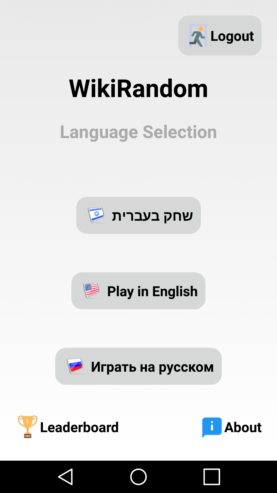

# WikiRandom-Android
Trivia game based on Wikipedia. Keep calm and be random!

About WikiRandom:

WikiRandom is a trivia game based on Wikipedia, which aims to enrich the user's broad Knowledge of random subjects in the following way:

In each round, the game's system draws a random Wikipedia article,that the user will be asked to guess.

Then,4 different discriptions(answers) will appear - Only one of them describes the article correctly.

Sometimes, a thumbnail image taken from article will be shown to give the user a little clue. 

Each time the user is right - he/she will earn 1 point. there is no detraction of the user's score for wrong answer.

After the guessing attempt, whether successful or not - the random article will appear and be available for reading until the user decides to 
continue to the next round.

The game can be played in Hebrew, English and Russian.

In addition, there is a high-score leaderboard - showing the top 10 scorers of WikiRandom (whether they are iOS or Android users).

##Here some screenshots from the application##

